

  
  <h1 align="center"> Hadoop Analysis </h1>

**Group 4 SBD-02**
+ Farras Rafi Permana - 2106700990
+ Zaki Ananda - 2106705474
+ Andikha Wisanggeni - 2106731503
+ M Fathan Muhandis - 2106731623

## What is Hadoop?
Hadoop adalah sebuah kerangka kerja (framework) open-source yang digunakan untuk pemrosesan dan penyimpanan data dalam skala besar secara terdistribusi. Hadoop dirancang untuk mengatasi tantangan dalam mengelola dan menganalisis data yang sangat besar (big data) yang tidak dapat ditangani dengan menggunakan sistem tradisional. Framework Hadoop hadir dan memungkinkan pengolahan data lebih banyak, menyimpan data heterogen dan mempercepat proses pengolahannya.

Dengan menggunakan Hadoop, perusahaan dan organisasi dapat memanfaatkan potensi data besar yang mereka miliki untuk mengambil wawasan bisnis yang berharga, melakukan analisis data yang kompleks, dan mengatasi tantangan pemrosesan data dalam skala besar. Hadoop juga memiliki ekosistem yang luas dengan berbagai komponen tambahan, seperti Apache Hive, Apache Pig, Apache HBase, Apache Spark, dan lainnya, yang memperluas kemampuan dan fungsionalitas Hadoop.

## How does Hadoop work?
Dalam Hadoop, terdapat empat modul utama yakni HDFS, YARN, MapReduce, dan Hadoop Common, berikut penjelasannya:

#### `Hadoop Distributed File System (HDFS)`

Merupakan sistem yang terdistribusi dan beroperasi di hardware standar maupun low-end.

#### `Yet Another Resource Negotiator (YARN)`

Merupakan sistem yang mengatur dan memonitor cluster node dan resource usage.

#### `MapReduce`

Merupakan framework yang membantu program untuk melakukan komputasi data secara paralel

#### `Hadoop Common`

Merupakan penyedia library Java yang dapat digunakan oleh semua modul

## Tools in Hadoop

Berikut beberapa tools yang terdapat pada hadoop, yaitu:

### 1. `Spark`

Spark merupakan processing system yang terdistribusi dan bersifat open source, dimana tools ini digunakan untuk melakukan batch processing, streaming analytics, machine learning, graph database, dan ad hoc query.

### 2. `Presto`

Seperti halnya Spark, Presto juga salah satu software yang bersifat open source. Presto sendiri merupakan SQL query engine terdistribusi yang digunakan untuk analisis data ad hoc low-latency.  Dengan Presto inilah, kita dapat memproses data dari sumber yang berbeda-beda, termasuk HDFS dan Amazon S3.

### 3. `Hive`

Hive digunakan untuk MapReduce dengan interface SQL, sehingga tool ini cocok untuk analisis data dalam jumlah yang besar.

### 4. `HBase`

HBase adalah database yang digunakan Amazon S3 dan HDFS. Tool ini dibuat untuk memproses tabel dengan baris dalam jumlah yang sangat banyak.

## Hadoop Advantages

Berikut beberapa kelebihan dari hadoop, yaitu:

### 1. `Fleksibel`

Data bisa disimpan dalam format apapun, baik secara structured maupun unstructured. Hal ini memungkinkan pengguna mengakses data dari sumber manapun dengan tipe apapun.

### 2. `Upgrade kapasitas`

Hadoop merupakan teknologi yang memberikan solusi pada sistem tradisional. Sistem tradisional memiliki data storage yang terbatas, sementara Hadoop bisa ditingkatkan kapasitasnya, sebab framework ini bekerja secara terdistribusi.

### 3. `Ketahanan tinggi`

HDFS merupakan bagian dari ekosistem Hadoop, yang dikenal memiliki ketahanan tinggi dan meminimalkan risiko kegagalan baik software maupun hardware. Meskipun satu node rusak atau mengalami masalah, HDFS bisa menyediakan backup data untuk melanjutkan proses.

## Getting Started

To get started with Hadoop, these are the prerequisites that must be installed:

1. Java 8 (Recommended) / Java 11
   + https://www.oracle.com/id/java/technologies/javase/javase8-archive-downloads.html
3. Hadoop (Kali ini memakai versi 3.2.2)
   + https://archive.apache.org/dist/hadoop/common/
5. Additional Binaries (Sesuaikan versi Hadoop, versi yang dipakai kali ini adalah 3.2.2)
   + https://github.com/styxnanda/winutils

### Details are in the presentation file in the repository Above.

## How to Install Hadoop

### 1. `Configure System Variables JAVA_HOME`
NOTE:
Tambahkan system variable baru bernama JAVA_HOME dan arahkan ke instalasi Java 

### 2. `Configure New Path Variable `
NOTE:
1) Cek versi java dengan command "java -version" pada CMD
2) Tambahkan di path, ke directory java dan arahkan ke folder bin

### 3. `Extract hadoop-3.2.2.tar.gz as admin`

### 4. `Edit \etc\hadoop\core-site.xml`
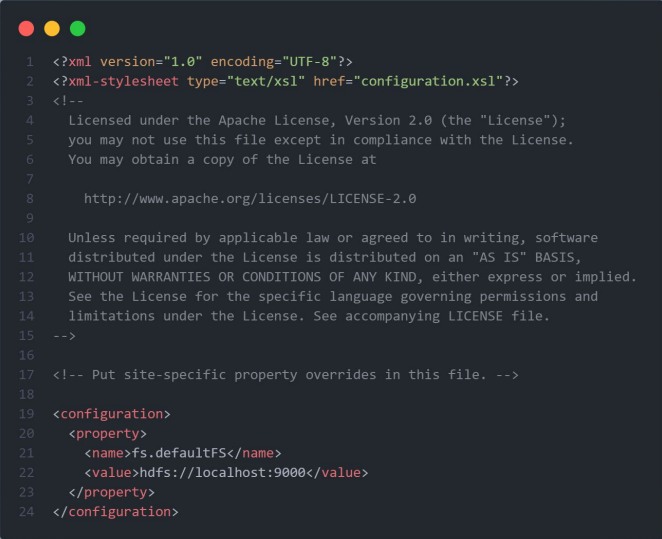

### 5. `Edit \etc\hadoop\mapred-site.xml`
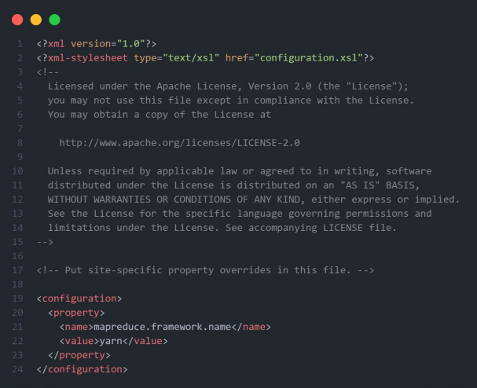

### 6. `Edit \etc\hadoop\yarn-site.xml`
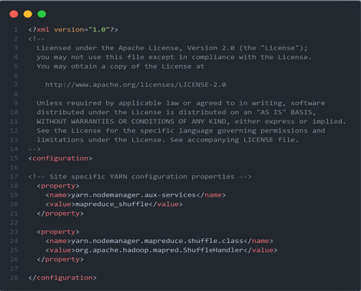

### 7. `Create directory and subdirectory named "data"`
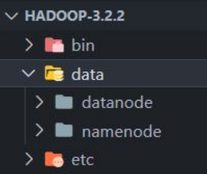

### 8. `Edit \etc\hadoop\hdfs-site.xml`
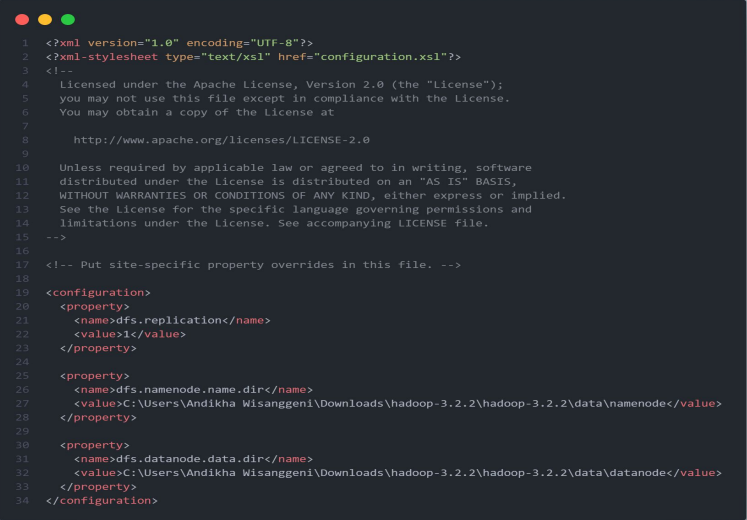

### 9. `Edit \etc\hadoop\hadoop-env.cmd`
NOTE:
Arahkan ke directory Java masing-masing

### 10. `Create HADOOP_HOME and path for /bin dan /sbin`

### 11. `Move bin from additional binaries to file hadoop (local) /bin`
NOTE:
File yang sama di overwrite.

### 12. `Verify Hadoop`
NOTE:
Cek versi hadoop dengan command "hadoop version" pada CMD

## How to Run Hadoop

### 1. `Format the namenode Folder`
#### Command: hdfs namenode -format
NOTE:
Berguna untuk menghapus data sebelumnya pada datanode dan namenode

### 2. `Open CMD`
NOTE:
Buka atau jalankan Command Prompt dengan **Run as Administrator**

### 3. `Run Hadoop`
1. Untuk memulai Hadoop dan daemon-nya, jalankan **start-all.cmd**
2. Untuk memberhentikan Hadoop dan daemon-nya, jalankan **stop-all.cmd**
3. Jika start-all.cmd dan stop-all.cmd sudah deprecated, jalankan *start-dfs.cmd* lalu **start-yarn.cmd**

### 4. `Check the GUI and Resource Manager`
Jalankan **localhost:9870** dan **localhost:8088** pada web browser

### 5. `Checking the Running Hadoop Daemons`
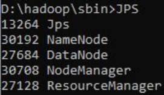

### 6. `Prepare the Input Text File`
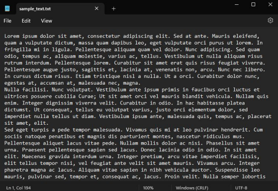

### 7. `Moving Text File to Input Directory HDFS`
#### `hadoop fs -mkdir /input_directory`
   Untuk membuat folder input pada HDFS 
#### `Hadoop fs -put “direct to file .txt” /input_directory`
   Untuk meletakkan file text ke folder input HDFS

### 8. `Verify Text File is in HDFS`
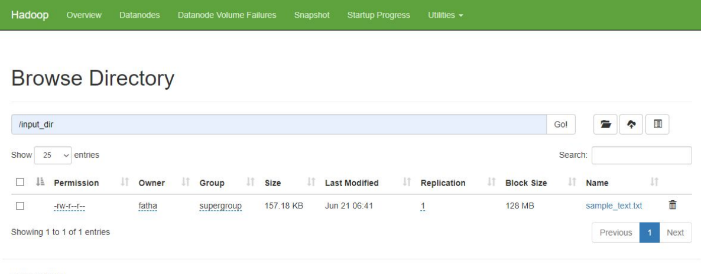
NOTE:
Cek pada localhost:9870 > utilities > browse directory > cari nama file input diawali dengan '/'

### 9. `Executing WordCount Program`
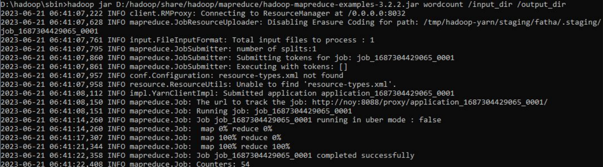
NOTE:
Semakin besar ukuran file input, maka akan semakin lama waktu yang dibutuhkan untuk memproses

### 10. `Check the Output`
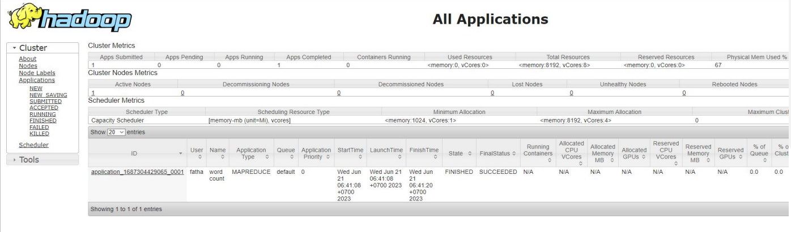
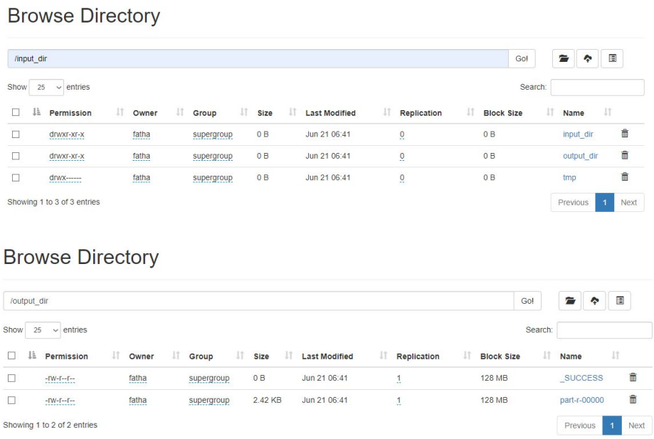
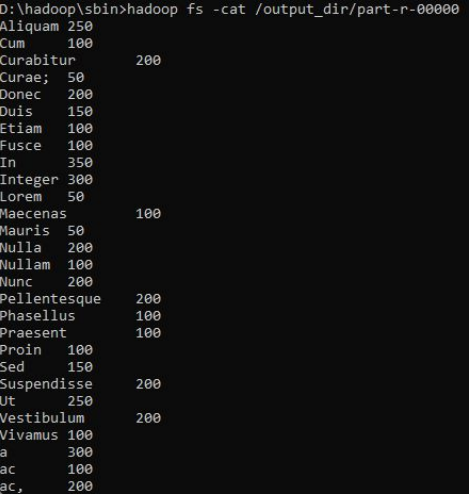

## Hadoop vs No Hadoop

Berikut beberapa hasil grafik percobaan word count menggunakan hadoop dengan tidak menggunakan hadoop (Java):

### 1. `With Hadoop`
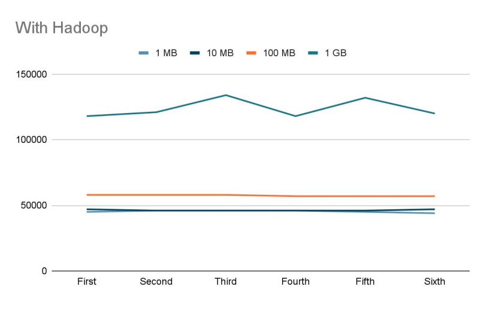

### 2. `Without Hadoop`
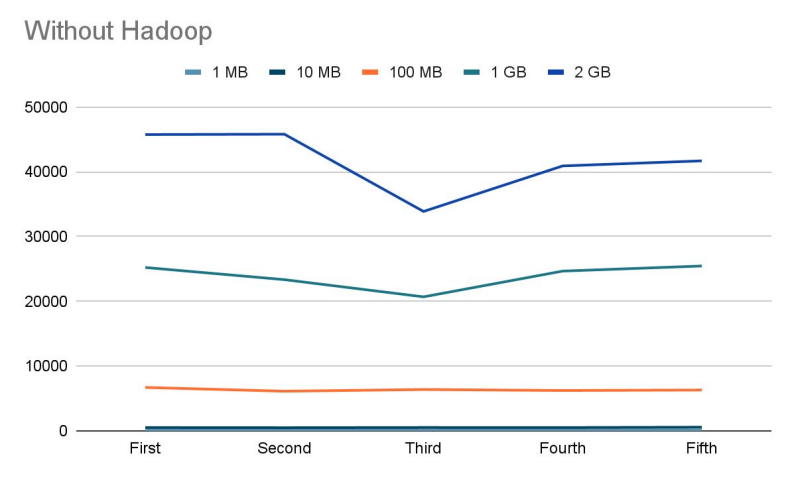

Kita juga melakukan percobaan word count hadoop menggunakan sistem operasi lain (Linux):

### 1. `Test on Other Machine`
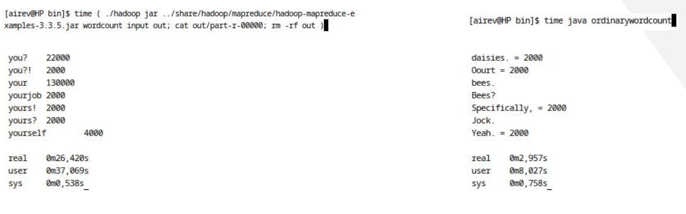

### 2. `Graph Test on Other Machine`
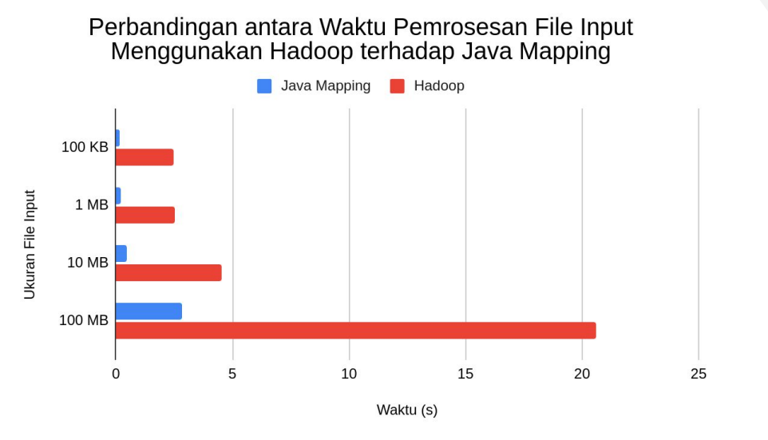

## Analisis Kinerja Haddop vs Java
Analisis Perbandingan Penggunaan MapReduce Word Count antara Hadoop dan Program Java:

### 1. `Kinerja`
#### `Hadoop`
Hadoop memiliki keunggulan dalam kinerja pemrosesan data besar (big data) secara terdistribusi. Dengan memanfaatkan cluster Hadoop, tugas-tugas dapat dibagi menjadi unit-unit yang lebih kecil dan didistribusikan di seluruh node, mempercepat waktu pemrosesan secara signifikan.
#### `Java`
Penggunaan Java untuk word count cenderung lebih cocok untuk data yang relatif kecil. Kinerja Java tergantung pada implementasi kode yang ditulis, tetapi tidak memiliki kemampuan terdistribusi bawaan seperti Hadoop.

### 2. `Skalabilitas`
#### `Hadoop`
Hadoop dirancang khusus untuk skalabilitas yang tinggi. Dengan penambahan node ke dalam cluster Hadoop, kapasitas pemrosesan dapat ditingkatkan sesuai kebutuhan yang mana memungkinkan Hadoop untuk mengatasi data yang sangat besar dan kompleks.
#### `Java`
Skalabilitas Java terbatas pada sumber daya yang tersedia di IDE tempat program dijalankan. Pengolahan data terbatas pada kapasitas mesin tersebut dan tidak secara otomatis terdistribusi ke beberapa node seperti Hadoop.

### 3. `Kompleksitas Pengembangan`
#### `Hadoop`
Implementasi word count dengan Hadoop memerlukan penulisan kode yang melibatkan konfigurasi job, pembuatan fungsi mapper dan reducer, serta penanganan input dan output. Hal ini memerlukan pemahaman yang baik tentang framework Hadoop dan memerlukan waktu dan usaha yang lebih.
#### `Java`
Implementasi word count dengan Java  lebih sederhana karena hanya perlu menulis kode Java untuk membaca teks, memisahkan kata, dan menghitung kemunculannya. Cara ini lebih mudah dipahami dan memerlukan waktu pengembangan yang lebih singkat.

### 4. `Infrastruktur`
#### `Hadoop`
Penggunaan Hadoop memerlukan infrastruktur cluster yang terdiri dari beberapa node, dimana membutuhkan konfigurasi dan penyiapan yang cermat serta pemahaman tentang pengelolaan cluster Hadoop.
#### `Java`
Penggunaan Java tidak memerlukan infrastruktur khusus, dimana pengguna dapat menjalankan program Java pada IDE yang diinginkan.

Pilihan antara Hadoop dan Java untuk word count bergantung pada kebutuhan dan skala data. Pilih Hadoop jika memiliki data besar dan kompleks, serta membutuhkan pemrosesan terdistribusi dan skalabilitas yang tinggi. Namun, jika data yang olah relatif kecil dan tidak memerlukan pemrosesan terdistribusi, penggunaan Java standalone akan lebih sederhana dan lebih efisien.

## References
#### [1] “Index of /dist/hadoop/common,” Apache.org, 2023. Available: https://archive.apache.org/dist/hadoop/common/.
#### [2] “Java Archive Downloads - Java SE 8 | Oracle Indonesia,” Oracle.com, 2019. Available: https://www.oracle.com/id/java/technologies/javase/javase8-archive-downloads.html.
#### [3] styxnanda, “GitHub - styxnanda/winutils: winutils.exe hadoop.dll and hdfs.dll binaries for hadoop windows,” GitHub, 2023. Available: https://github.com/styxnanda/winutils.
#### [4] “Apa Itu Hadoop? Tools Yang Banyak Digunakan Dalam Big Data – Inixindo Jogja,” Inixindo Jogja, Mar. 23, 2022. Available: https://inixindojogja.co.id/apa-itu-hadoop-big-data/.
#### [5] SkillsBuild Training, “ How to Install Hadoop on Windows 11,” YouTube. Apr. 18, 2022. Available: https://www.youtube.com/watch?v=GNHF0DZK3xQ&t.
#### [6] A. Devkar, “Run Wordcount Program on Hadoop-3.3.0 windows 10,” YouTube. May 13, 2021. Available: https://www.youtube.com/watch?v=nsi4nVS16lc&t.
